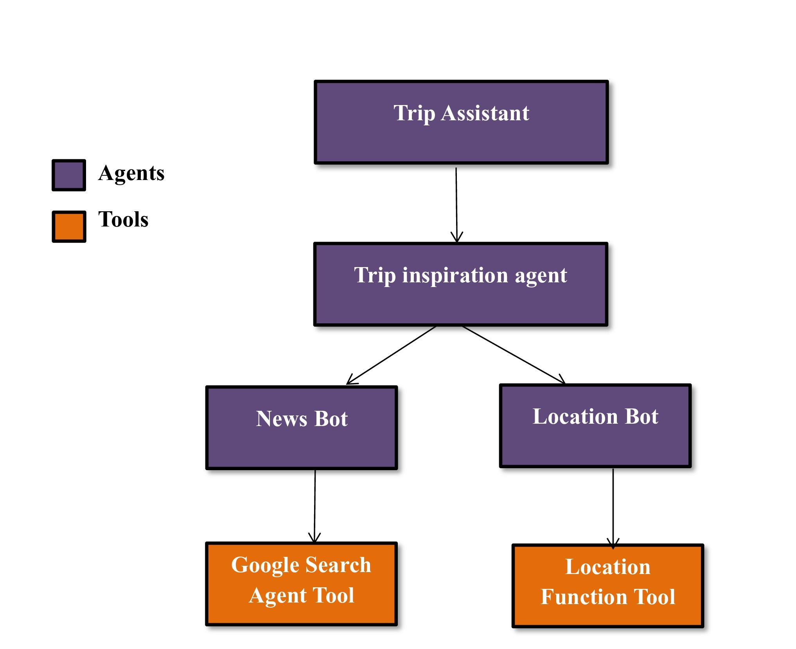

# SMART TRIP AGENT SYSTEM 

An AI-powered multi-agent travel assistant built using Google ADK, designed to generate travel inspiration, find destinations, fetch latest news, and locate nearby places using OpenStreetMap & Google search tools.


## Project Overview 

Smart Trip Agent is a modular AI system where multiple agents work together to plan trips, recommend places, and enhance user travel experiences. Each component—trip planner, inspiration agent, news bot, and location bot—is independently testable and expandable.

 ## Architecture 


## Folder Structure 

```
SMART TRIP AGENT SYSTEM 
|
|--.venv
|--Trip_Assistent
|--|--.env
|--|--agent.py
|--|--supporting_agent.py
|--|--tools.py
|--.gtignore
|--.python-version
|--flow-1.jpg
|--main.py
|--pyproject.toml
|--README.md
|--uv.lock 
```

## Project Setup and installation 

### Phase-1:-

Follow these steps to create the base ADK project:

**Initialize project**
```
uv init 
```

**Install dependencies**
```
uv add google-adk python-dotenv
```
**Create agent directory**
```
mkdir Trip_Assistant
```

**Inside Trip_Assitant, create core files**
```
agent.py
supporting_agent.py
tools.py
```

**Test your agent after each stage**
- Make small Update.
- Run and validate functionality

### Phase-2:- 

1. #### Build the Root agent 
    - Organizes & manages all sub-agents
    - Ensures proper routing of user queries
2. #### Test the root agent
```
uv run adk web 
```
This launches the ADK web interface for testing.

3. #### Build the Trip Inspiration Agent
    - Suggests destinations
    - Gives travel themes & ideas

4. #### Create Google Search Tool for News Bot
    - Uses Google ADK's search integration
    - Fetches real-time travel updates

5. #### Build the News Bot Agent

    - Provides latest news related to destinations
    - Helpful for safety, events, alerts

6. #### Add Nearby Places Tool

    - Build find_nearby_places_open function
    - Uses OpenStreetMap (no API key required)
    - Register using FunctionTool

7. #### Build Location Bot Agent

    - Finds nearby attractions, restaurants, spots

    - Interacts with map tools

Each agent should be tested individually for reliability.

### Phase-3:- 

After all agents and tools are integrated:
- Test the entire multi-agent system
- Validate each route/response
- Ensure communication between agents is correct
- Verify all tools execute successfully

Final testing ensures the Smart Trip Agent works smoothly end-to-end.

### Flow Chart 

